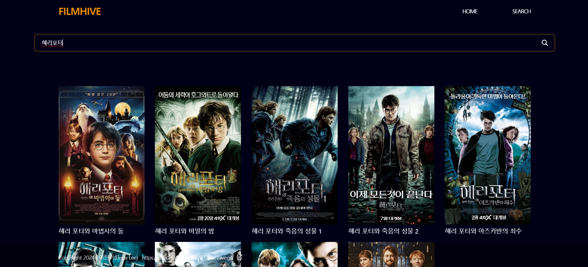

# 프로젝트명: FILMHIVE

### 영화리뷰앱👀

### 배포주소

필름하이브 바로가기: <https://elena7993.github.io/filmhive/>

### 1. 앱 이미지

### 2. 목적

이 앱을 통해 사용자들이 영화를 빠르게 검색하고 영화를 보기 전 영화에 대한 정보를 얻을 수 있다.

### 3. 기능

- 영화 검색
- 영화 상세 페이지
- 영화 트레일러 영상보기

### 4. 스택

- HTML, CSS, JavaScript, React, TMDB API, Figma

### 5. 개발 스케줄

| 날짜      | 작업 내용                                                                                                                                                            |
| --------- | -------------------------------------------------------------------------------------------------------------------------------------------------------------------- |
| 11월 7일  | - API 선정 및 기획서 작성 - 디자인 작업 시작                                                                                                                      |
| 11월 8일  | - 디자인 작업 완성 - 코드 초기 세팅: 폴더 구조 정리, 초기 파일 생성, 프로젝트 기본 세팅 - 기본 구성요소 세팅                                                   |
| 11월 9일  | - API 연동 및 기능 구현: TMDB API를 연동해 영화 데이터를 불러오는 기능 구현 - 홈 화면 구성: 기본적으로 영화 리스트를 보여주는 메인화면 제작 - 상세 페이지 구성 |
| 11월 10일 | - 홈 화면 데이터 추가 및 수정: 홈 화면에 필터나 검색 기능 추가 - 상세페이지 데이터 추가 및 구성: API에서 상세 정보와 예고편 데이터 가져오기 - 서치 페이지 구성 |
| 11월 11일 | - 404 페이지 구성 - 상세 페이지 수정 - 서치 페이지 수정 - 반응형 수정                                                                                       |
| 11월 12일 | - 반응형 수정 - 404 페이지 구성 - 디자인 수정 및 코드 정리 - 버그 수정 및 최종 테스트 - 유지 보수 및 배포 준비 - 배포                                 |

### **6. 작업하면서 느낀 점**

**(1)문제 발생과 해결을 위한 시도**

**(2)디자인과 로직의 균형**

**(3)향후계획 및 총평**
